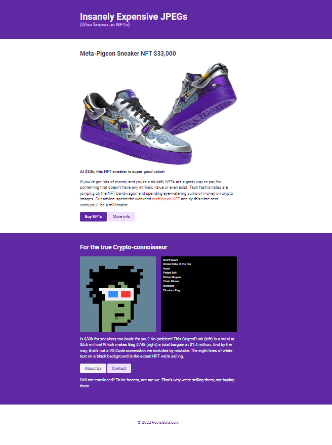
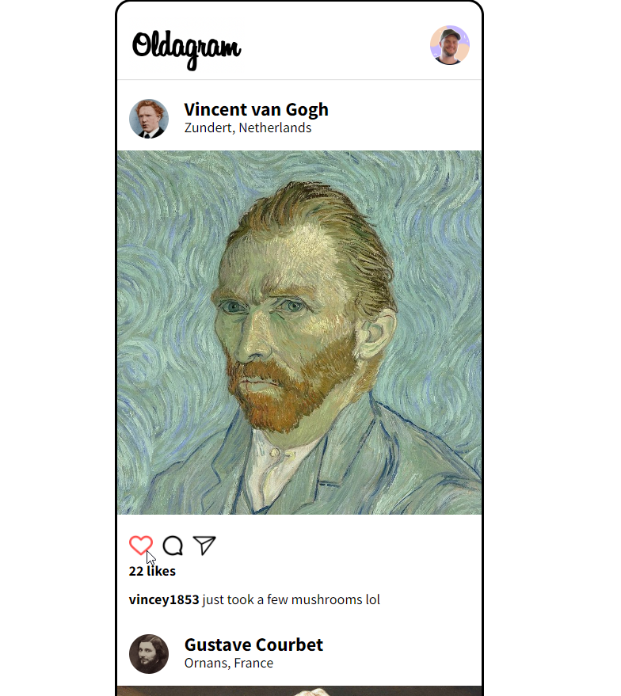
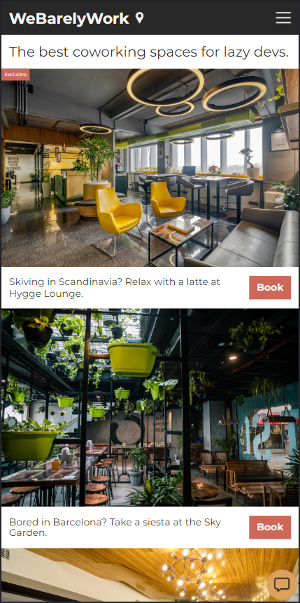

# Overview

Completed these projects from the Scrimba's Essential CSS Concepts course (module 4 of the [Frontend Developer Career Path](https://scrimba.com/learn/frontend)). I practiced HTML, CSS and JavaScript with these projects. You can see the visual representations of each one right below. 

# Projects

## 1- NFT Site

### Screenshot 

### What I learned / practiced 

- Semantic HTML
- Hover and active states
- Specificity
- Compound selectors 
- Inline block
- Multiple blocks on one element

## 2- Oldagram (Solo Project)

### Screenshot 

### Link

[Live Solution](https://oldagram-scrimba-clement-bartholome.netlify.app/)

### Goals 

- Create a clone of Instagram from a Figma design
- Render all posts using JavaScript
- Increase the likes count when clicking the like button

### What I learned / practiced

- Semantic HTML 
- CSS (flexbox)
- JavaScript DOM manipulation

## 3- Coworking Space Site 

### Screenshot 

### What I learned / practiced

- margin:auto on flex children
- position:absolute & relative
- align self
- position:fixed
